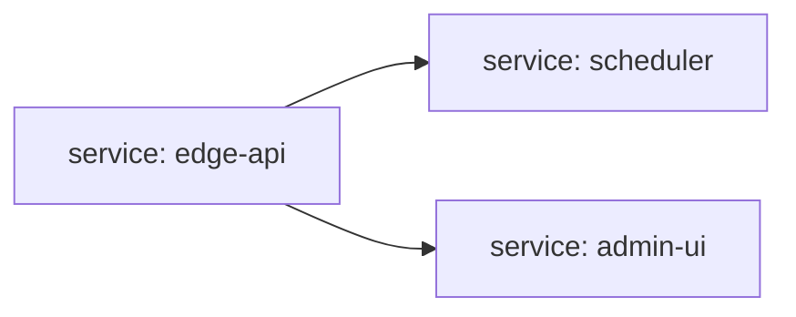

C4 L2 - Containers (Fixture)
============================

This fixture models three services from `harness/manifest.yaml` with a non-uniform monorepo layout:

- Edge API service -> `docs/services/edge-api/index.md`
- Scheduler worker -> `docs/services/scheduler/index.md`
- Admin UI package -> `docs/services/admin-ui/index.md`

