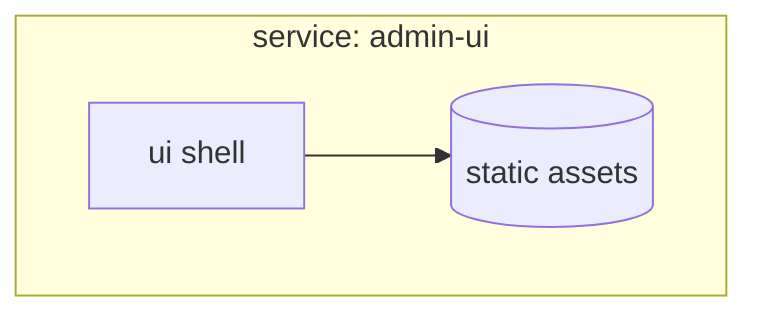

C4 L3 - Components (Service: admin-ui) (Fixture)
===============================================

```mermaid
flowchart TB
  subgraph admin_ui[service: admin-ui]
    shell[ui shell] --> static_assets[(static assets)]
  end
```
