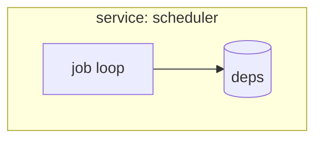

C4 L3 - Components (Service: scheduler) (Fixture)
================================================

```mermaid
flowchart TB
  subgraph scheduler[service: scheduler]
    loop[job loop] --> deps[(deps)]
  end
```
