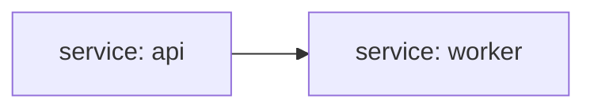

C4 L2 - Containers (Fixture)
============================

This fixture models two services from `harness/manifest.yaml`:

- API service -> `docs/services/api/index.md`
- Worker service -> `docs/services/worker/index.md`

