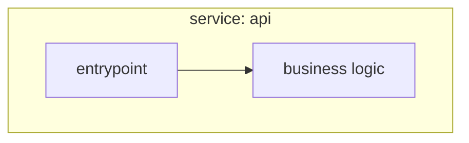

C4 L3 - Components (Service: api) (Fixture)
==========================================

- OpenAPI contract -> `specs/api/openapi.yaml`

```mermaid
flowchart TB
  subgraph api[service: api]
    entry[entrypoint] --> core[business logic]
  end
```

