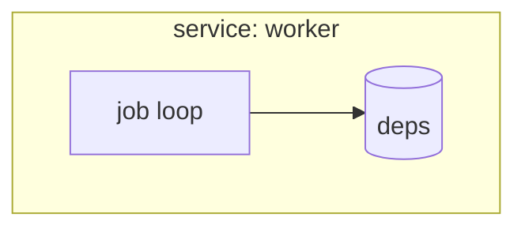

C4 L3 - Components (Service: worker) (Fixture)
=============================================

- OpenAPI contract -> `specs/worker/openapi.yaml`

```mermaid
flowchart TB
  subgraph worker[service: worker]
    loop[job loop] --> deps[(deps)]
  end
```

